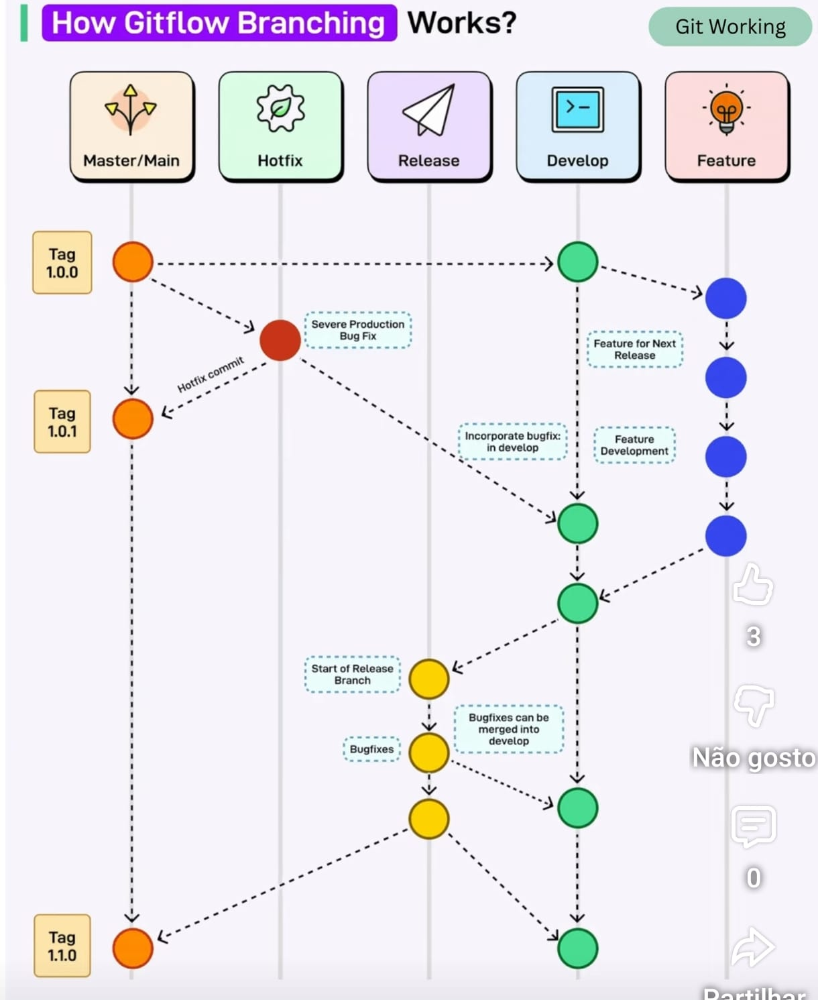

# Git Flow Operation (Guia Prático)
## 🔀 Git Flow (Fluxo de Trabalho com Git)

### O que é Git Flow?

**Git Flow** é um modelo de organização de branches que define **regras claras** para:

* desenvolvimento
* correções
* releases
* hotfixes

O objetivo é:

> Manter o código organizado, previsível e seguro ao longo do ciclo de vida da aplicação.

---

## Branches principais no Git Flow

| Branch      | Função                         |
| ----------- | ------------------------------ |
| `main`      | Código em produção             |
| `develop`   | Código em desenvolvimento      |
| `feature/*` | Novas funcionalidades          |
| `release/*` | Preparação de versões          |
| `hotfix/*`  | Correções urgentes em produção |

---

## Visão geral do fluxo

```text
feature/* → develop → release/* → main -> tag/*
                                   ↑
                                hotfix/*
```

* **Nunca** se desenvolve diretamente em `main`
* Toda mudança deve passar por **review + pipeline**
* `main` representa sempre código pronto para produção


---

## Exemplo prático de Git Flow

### Cenário

Vamos desenvolver a funcionalidade **login** e lançar a versão `v1.0.0`.

---

### 1️⃣ Criar branch de desenvolvimento

```bash
git checkout -b develop
```
```bash
git push -u origin develop
```

`develop` será a base de todas as features.

---

### 2️⃣ Criar uma feature

```bash
git checkout develop
```
```bash
git checkout -b feature/login
```

Alterar o código (adicionar ficheiro login.py no raiz do projeto), depois:

```bash
git add .
```

```bash
git commit -m "feat: adiciona funcionalidade de login"
```
```bash
git push -u origin feature/login
```

---

### 3️⃣ Merge da feature para develop (via Pull/Merge Request)

No GitHub/GitLab:

* Criar **Pull Request**
* `feature/login` → `develop`
* Revisão de código
* Pipeline CI executa

**Aqui entram:**

* SAST (SonarQube)
* testes
* lint

---

### 4️⃣ Criar branch de release

Quando o conjunto de features está pronto:

```bash
git checkout develop
```
```bash
git pull
```
```bash
git checkout -b release/1.0.0
```

Nesta fase:

* apenas correções
* ajuste de versões
* documentação

- Alterar ficheiro login.py adicionando um comentário, depois:
```bash
git add . && git commit -m "chore: prepara release 1.0.0"
```
```bash
git push -u origin release/1.0.0
```

---

### 5️⃣ Merge da release para main (produção)

No GitHub/GitLab:

* Pull Request
* `release/1.0.0` → `main`
* Pipeline CI/CD executa

Depois do merge:

TAG: é um ponteiro para uma versão do repositório.
```bash
git tag v1.0.0
```
```bash
git push origin v1.0.0
```

**A tag dispara o CI/CD** (ex.: build e deploy).

---

### 6️⃣ Sincronizar main de volta para `main` e `develop`

```bash
git checkout develop
```
```bash
git merge main
```
```bash
git push origin develop
```

Garante que `develop` contém tudo o que está em produção.

---

## Hotfix (correção urgente em produção)

### Cenário

Bug crítico encontrado em produção (`main`).

```bash
git checkout main
```
```bash
git pull
```
```bash
git checkout -b hotfix/fix-login-redirect
```

Corrigir bug, alterando login.py, depois:

```bash
git add . && git commit -m "fix: corrige redirect no login"
```
```bash
git push -u origin hotfix/fix-login-redirect
```

Depois:

* Merge para `main` (No GitHub/GitLab)
* Tag `v1.0.1`
    * ```bash
      git tag v1.0.1
    ```
* push Tag `v1.0.1` para o repositório:
    * ```bash
      git push origin v1.0.1
    ```
* Merge também para `develop` e `push`:
    * ```bash
      git checkout develop
        ```
    * ```bash
       git pull
        ```

    * ```bash
      git merge hotfix/fix-login-redirect
        ```

    * ```bash
      git push origin develop
        ```

---

## Git Flow e DevSecOps

### Porque Git Flow ajuda na segurança?

* Obriga a utlização de **Pull Requests**
* Facilita:

  * revisão de código
  * execução de SAST/DAST
  * bloqueio de código inseguro
* Protege a branch `main`

**Sem Git Flow, não há DevSecOps estruturado.**

---

## Resumindo:

* `main` → produção
* `develop` → integração contínua
* `feature/*` → desenvolvimento
* `release/*` → estabilização
* `hotfix/*` → urgências

---

## Documentação oficial

* Git Flow (modelo original):
  [https://nvie.com/posts/a-successful-git-branching-model/](https://nvie.com/posts/a-successful-git-branching-model/)
* Git Branching (Git Book):
  [https://git-scm.com/book/en/v2/Git-Branching-Branching-Workflows](https://git-scm.com/book/en/v2/Git-Branching-Branching-Workflows)
* GitHub Flow (comparação):
  [https://docs.github.com/en/get-started/quickstart/github-flow](https://docs.github.com/en/get-started/quickstart/github-flow)
